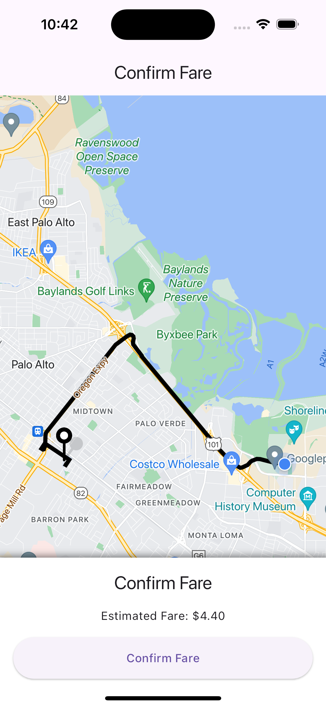
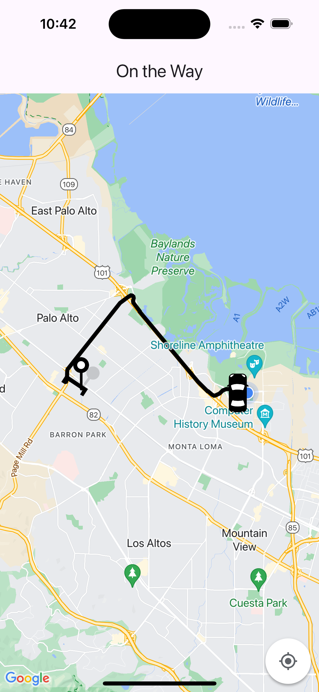

# Uber Clone

A Sample Application created in Flutter using Google Maps API and Supabase for Realtime database for simulating Driver and Rider Interactions.

### Setup for Pushing the Code as Supabase Functions are required which are inside supabase Folder. Please read Documentation for more details.

All the Steps to follow and create this project can be found in this Video from Supabase Channel. [Uber Clone](https://www.youtube.com/watch?v=cL4pVpaOH9o).

## Screenshot of the App

**_Note: Further improvements can be found in subsequent branches. Most probably branch name: final_**
